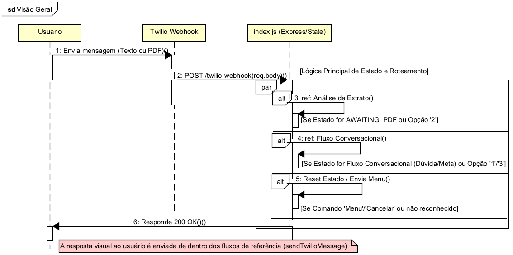
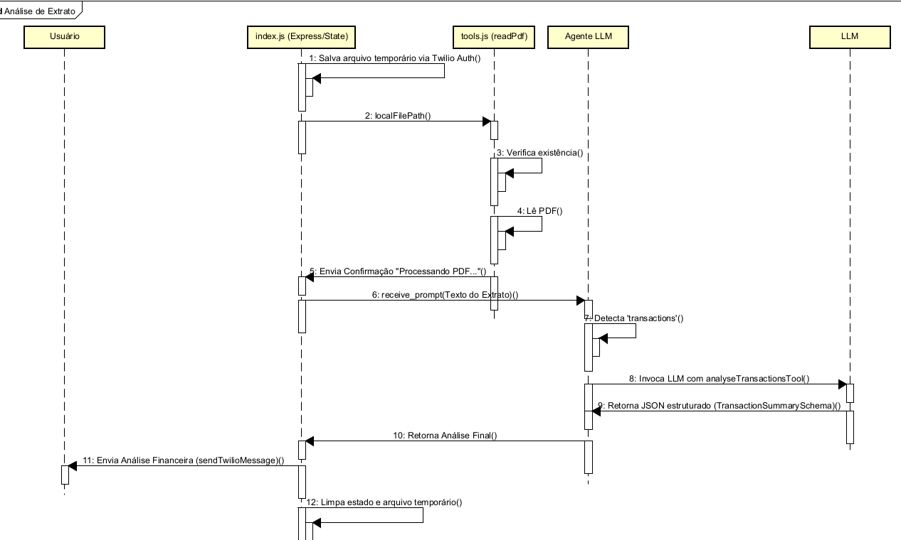
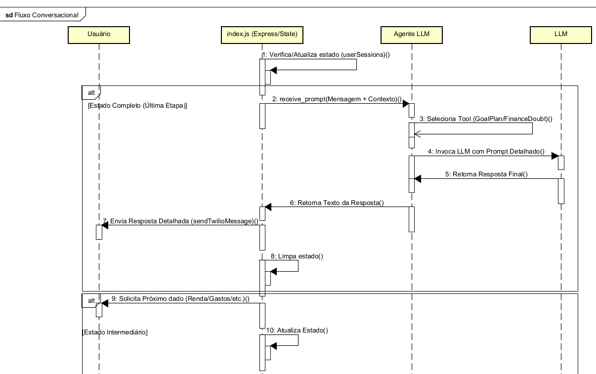
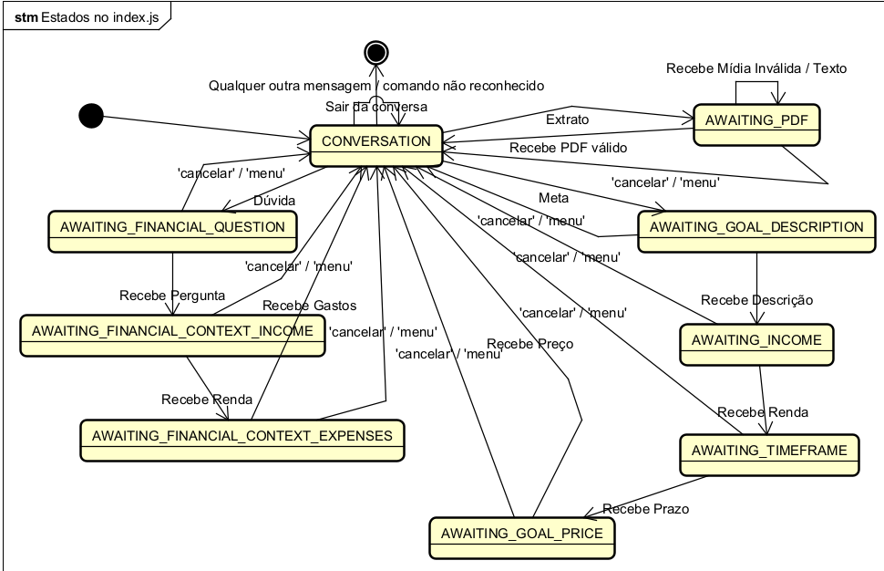

# 🤖 Bank-AI-Agent

Um assistente pessoal bancário conversacional desenvolvido com Inteligência Artificial para revolucionar a interação do usuário com suas finanças via WhatsApp, focado em consultoria e análise de documentos.

## Visão Geral

O projeto **Bank-AI-Agent** é um bot de WhatsApp que utiliza a arquitetura de Agentes de IA (LangChain/Gemini) para fornecer serviços financeiros inteligentes. Atuando como o **Assistente Digital do BTG Pactual**, o sistema guia o usuário através de três principais fluxos de serviço:

1. Tirar Dúvida Financeira: Respostas personalizadas baseadas em contexto de renda e gastos.

2. Análise de Extrato: Processamento e análise estruturada de extratos bancários em PDF.

3. Planejamento de Metas: Criação de planos detalhados de economia e investimento.

Este sistema utiliza um servidor Express para gerenciar o estado da conversa (máquina de estados), garantindo que o Agente de IA receba o contexto completo em cada etapa.

## Funcionalidades Principais

- **Análise de Documentos:** Capacidade de receber e processar arquivos PDF (extratos) para extrair dados financeiros brutos.

- **Consultoria Financeira Detalhada:** O Agente de IA é instruído a fornecer respostas longas, profissionais e detalhadas, como um consultor financeiro do BTG Pactual.

- **Gerenciamento de Fluxo Conversacional (Máquina de Estados):** O servidor Node.js mantém o contexto da sessão (quem está falando, qual estado) para guiar o usuário em conversas multi-turno.

- **Arquitetura Baseada em Ferramentas (Tool Calling Agent):** O Agente de IA usa ferramentas especializadas para delegar e resolver tarefas específicas (análise estruturada de PDF, planejamento de metas).

- **Interface Conversacional:** Interação amigável via chat do WhatsApp, integrada pela API da Twilio.

## ⚙️ Tecnologias Utilizadas

| Componente              | Tecologia               | Uso Específico                                                            |
| :---------------------- | :---------------------- | :------------------------------------------------------------------------ |
| **Linguagem**           | JavaScript (ES Modules) | Servidor e lógica de Agente.                                              |
| **Servidor/Webhook**    | Express.js              | Roteamento e recebimento de webhooks da Twilio.                           |
| **Comunicação**         | Twilio API              | Envio/Recebimento de mensagens e mídias do WhatsApp.                      |
| **LLM/Agentes**         | LangChain.js            | Framework para Agentes, Tools e Prompts.                                  |
| **Modelo de Linguagem** | Google Gemini 2.5 Flash | O LLM central para raciocínio e geração de texto.                         |
| **Parsing Estruturado** | Zod + LangChain         | Definição e validação de schemas de saída JSON (para análise de extrato). |
| **Leitura de PDF**      | `pdfreader`             | Extração do texto bruto de arquivos PDF.                                  |

## 📐 Contexto e Diagramas

O projeto opera em um ciclo contínuo onde o `index.js` atua como o **Roteador e Gerente de Estado**, e o `agent.js` atua como o **Motor de Decisão e Lógica de IA**.

### 1. Diagrama de Sequência Principal (Visão Geral)

Este diagrama mostra o ciclo de vida de **toda** requisição que chega ao servidor. Os **Passos 3, 4, e 5** representam os pontos de decisão, onde o Handler (`index.js`) verifica o estado do usuário e delega a tarefa ao fluxo específico.



### 2. Fluxo de Análise de Extrato (Sub-Fluxo 'Análise de Extrato')

Este sub-fluxo é executado quando o usuário está no estado `AWAITING_PDF`. Ele detalha a interação com o sistema de arquivos e a ferramenta `analyseTransactionsTool` do Agente.



### 3. Fluxo Conversacional (Sub-Fluxo 'Dúvidas e Metas')

Este sub-fluxo detalha a lógica de coleta de dados em múltiplas etapas (estados intermediários) ou a chamada direta ao Agente LLM (última etapa), usando as ferramentas `financeDoubtTool` e `goalPlanTool`.



### Diagrama de Máquina de Estados (Gerenciado por index.js)

O `index.js` utiliza a variável `userSessions` para garantir que o usuário seja guiado por fluxos de conversação multi-turno de forma correta, com o comando universal **'cancelar'** ou **'menu'** sempre disponível.



## 🚀 Como Executar o Projeto (Guia Rápido)

### Pré-requisitos

- Node.js (versão LTS)

- Conta Twilio com um número de WhatsApp configurado

- Chave de API do Google Gemini

### 1\. Clonar o Repositório

```bash
git clone https://github.com/NicMota/Bank-AI-Agent.git
cd Bank-AI-Agent
```

### 2\. Configuração do Ambiente

Instale as dependências do Node.js:

```bash
npm install
cd agentjs
npm install
cd ..
```

### 3\. Configurar Chaves de API

Crie um arquivo `.env` na raiz do projeto e adicione suas chaves e credenciais da Twilio:
A criação de uma conta na ferramenta SandBox da Twilio é indispensável, pois ela que faz a conexão com a API do WhatsApp.

(https://www.twilio.com/login)

O usuário terá que criar uma conta grátis, obter o Account SID e AuthToken no Twilio Console (Página que você entra logo após se cadastrar/logar),
desça até a seção 'Account Info' e copie os campos para o .env


Após isso, clique na seção de 'Messaging' na navbar lateral do console, clique em 'Try it out', clique em 'Send a WhatsApp message'.
Por fim, conecte ao handler da Twilio escaneando o QRCOde.
```Ini, TOML
# Chave da API do Gemini
GEMINI_API_KEY="SUA_CHAVE_GEMINI_AQUI"

# Credenciais da Twilio
TWILIO_ACCOUNT_SID="ACXXXXXXXXXXXXXXXXXXXXXXXXXXXXXXXX"
TWILIO_AUTH_TOKEN="your_auth_token"
TWILIO_WHATSAPP_NUMBER="whatsapp:+14155238886"
PORT=3000
```

### 4\. Executar o Agente

Inicie o servidor Node.js:

```bash
node server/index.js
```

### 5\. Configurar o Webhook

Use uma ferramenta como **ngrok** para expor seu servidor local à internet (necessário para a Twilio) e configure o **Webhook** de mensagens do seu número de WhatsApp Twilio para o endereço:

Lembra do console da Twilio na parte de 'Send a WhatsApp message'? Ainda dentro dele - após mandar a mensagem de confirmação para a twilio pelo chat do whatsapp -, vá até Sandbox settings e então
coloque o webhook do ngrok, lembre-se de adicionar o '/twilio-webhook' ao final da sua rota HTTP,

```
[SEU_URL_NGROK]/twilio-webhook
```

## 🛠️ Estrutura do Projeto

A estrutura do projeto geralmente segue este padrão

```
Bank-AI-Agent/
├── .env                    # Variáveis de ambiente e chaves
├── node_modules/           # Dependências do Node.js
├── package.json            # Dependências e scripts
├── server
|   ├── index.js            # Servidor Express, Webhook da Twilio e Gerenciador de Estados
└── agentjs/
    ├── agent.js            # Lógica do Agente LLM (LangChain, Gemini, Tools)
    └── tools.js            # Funções utilitárias (e.g., readPdf)
```

---
